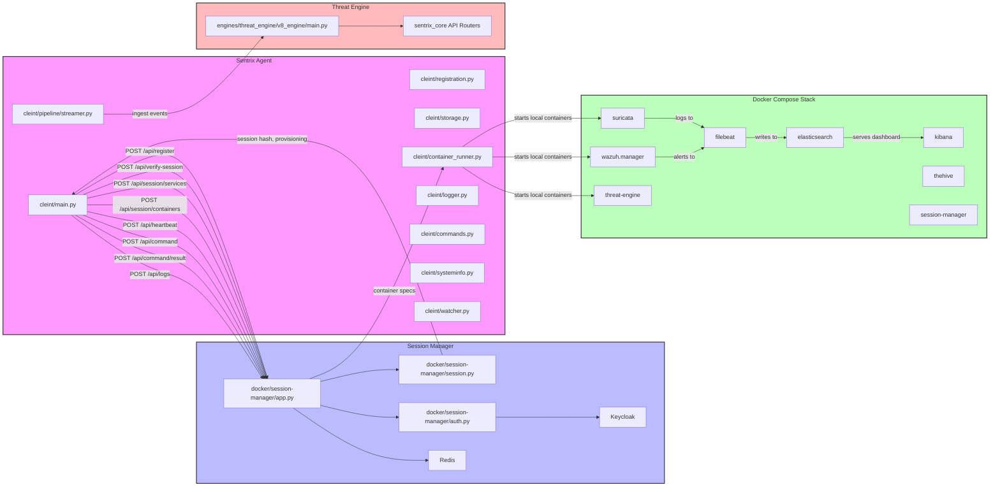

# Sentrix Architecture and Flow Control

## Architecture Overview



## Detailed Flow Control

```mermaid
flowchart TB
    subgraph AgentInit [Agent Initialization & Boot]
        direction TB
        Start[Start: cleint/main.py]
        LoadSession[Load session from APP_DATA_DIR/session.json]
        HasSession?{Session file exists?}
        Register[Register with server via cleint/registration.py]
        Verify[Verify session hash via cleint/storage.py]
        TamperCheck{Verification status}
        FetchServices[POST /api/session/services]
        FetchContainers[POST /api/session/containers]
        SetupContainers[cleint/container_runner.py -> ensure_container()]
        LaunchThreads[Start heartbeat, command poll, stream, watcher threads]
    end

    Start --> LoadSession
    LoadSession --> HasSession?
    HasSession? -->|No| Register
    Register --> FetchServices
    Register --> FetchContainers
    FetchContainers --> SetupContainers
    HasSession? -->|Yes| Verify
    Verify --> TamperCheck
    TamperCheck -->|valid| FetchServices
    TamperCheck -->|unreachable| FetchServices
    TamperCheck -->|unknown| Register
    TamperCheck -->|tampered| AlertAdmin[Report tamper and poll approval]
    AlertAdmin -->|approved| Register
    AlertAdmin -->|rejected| EndFail[Exit agent]
    FetchServices --> FetchContainers
    FetchContainers --> SetupContainers
    SetupContainers --> LaunchThreads

    subgraph Runtime [Runtime Loops]
        direction TB
        Heartbeat[Heartbeat thread]
        CommandPoll[Command poll thread]
        Streamer[Streamer loop]
        Watcher[File watcher]
    end

    LaunchThreads --> Heartbeat
    LaunchThreads --> CommandPoll
    LaunchThreads --> Streamer
    LaunchThreads --> Watcher

    Heartbeat -->|POST /api/heartbeat| S1[Session Manager]
    CommandPoll -->|POST /api/command| S1
    Streamer --> Collect[collect events from Suricata/Wazuh]
    Watcher --> Tail[tail logs from logs/suricata/eve.json]
    Collect --> Process[process(event) in cleint/pipeline/compute.py]
    Process --> Write[write(event) in cleint/pipeline/writer.py]
    Write --> ThreatIngest[send_to_Threat_engine in cleint/pipeline/threat_engine_client.py]
    Write --> DashboardIngest[send_to_dashboard]
    ThreatIngest -->|POST /api/v1/threat/events/ingest| T1[Threat Engine]
    DashboardIngest -->|POST /api/events| Dashboard[Dashboard service]
    CommandPoll -->|received command| Execute[cleint/commands.py handle_command()]
    Execute -->|POST result| S1

    subgraph Services [Service Routing & Normalization]
        direction LR
        ELK[Elasticsearch/Kibana]
        Wazuh[Wazuh Manager]
        Suricata[Suricata]
        Filebeat[Filebeat]
    end

    Suricata -->|eve.json logs| ELK
    Wazuh -->|alerts| ELK
    Filebeat -->|ship logs| ELK
    ELK -->|used by| Dashboard
    ELK -.->|optional API/alert stream| Streamer

    classDef agent fill:#fdf6e3,stroke:#333,stroke-width:1px;
    classDef runtime fill:#e7f5ff,stroke:#333,stroke-width:1px;
    classDef services fill:#e8ffe8,stroke:#333,stroke-width:1px;
    class AgentInit, Runtime agent;
    class Services services;
```
